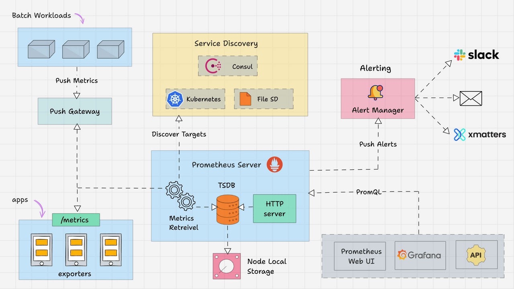

# Prometheus Monitoring Stack



Here’s a quick start guide using a Docker Compose file to launch a [Prometheus](`http://prometheus.io/`) monitoring stack. This setup includes Prometheus, Grafana, and the Node Exporter, giving you a complete solution to monitor your Docker infrastructure.

---

## 🐬 Containers Defination

- **Prometheus** – Central metrics database and monitoring engine.
- **Prometheus Pushgateway** – Accepts metrics pushed from short-lived or batch jobs.
- **Alertmanager** – Handles and manages alerts generated by Prometheus.
- **Grafana** – Provides dashboards and visualizations for collected metrics.
- **Node Exporter** – Collects host-level hardware and OS metrics.
- **cAdvisor** – Monitors and exposes container-level performance metrics.
- **Blackbox Exporter** – Probes endpoints (HTTP, HTTPS, DNS, TCP, ICMP, gRPC) for availability and response monitoring.

---

## 📁 Project Structure

```bash
prometheus-stack
├── alertmanager
│   └── alertmanager.yml
├── blackbox
│   └── blackbox-exporter.yml
├── docker-compose.yml
├── grafana
│   ├── dashboards
│   │   ├── BlackboxPingTest.json
│   │   ├── dashboard.yml
│   │   ├── DockerContainerMonitor.json
│   │   ├── GrafanaMetrics.json
│   │   ├── NodeExporterFull.json
│   │   ├── Prometheus2.0Stats.json
│   │   └── Traefik2Dashboard.json
│   └── datasources
│       └── datasource.yml
├── image
│   └── Prometheus-Architecture.gif
├── prometheus
│   ├── alerts
│   │   ├── Alertmanager.rules
│   │   ├── BlackBox.rules
│   │   ├── Cadvisor.rules
│   │   ├── Node_Exporter.rules
│   │   ├── Prometheus.rules
│   │   └── Traefik.rules
│   └── prometheus.yml
│── Prometheus-Service-Discovery.md
│── README.md
└── traefik-core
    └── docker-compose.yml
```

---

## ⚙️ How to configure Prometheus Stack?

### Change environment variables:

```bash
# Services image tag
PROMETHEUS_IMAGE_TAG=v3.5.0
GRAFANA_IMAGE_TAG=11.5
ALERTMANAGER_IMAGE_TAG=v0.28.1
PUSHGATEWAY_IMAGE_TAG=v1.11.1
CADVISOR_IMAGE_TAG=v0.52.0
BLACKBOX_EXPORTER_IMAGE_TAG=v0.27.0
NODE_EXPORTER_IMAGE_TAG=v1.9.1

# Domain address
DOMAIN_ADDRESS=observability.byparsa.dev
PROSUB=metrics
GRASUB=grafana
ALESUB=alerts
PGWSUB=pushgw

# Grafana Auth
GRAFANA_USERNAME=DevOps
GRAFANA_PASSWORD=<GRAFANA_ADMIN_PASSWORD>
GRAFANA_INSTALL_PLUGINS=grafana-clock-panel,grafana-simple-json-datasource,grafana-piechart-panel

# Server Name
HOSTNAME=observability

# set restart policy
RESTART_POLICY=on-failure
```

### Setup Grafana:

Open http://<host-ip>:3000 in your browser and log in with the default credentials:

- **Username:** `admin`
- **Password:** `admin`

You can update these credentials either directly in the Compose file or by defining the environment variables `GRAFANA_USERNAME`, `GRAFANA_PASSWORD`, and `GRAFANA_INSTALL_PLUGINS` in a `.env` file before running docker compose up.

Grafana is provisioning dashboards and data sources with these configs:

```bash
apiVersion: 1
datasources:
- name: Prometheus
  type: prometheus
  access: proxy
  url: http://prometheus:9090
  editable: true
  isDefault: true
```

```bash
apiVersion: 1
providers:
- name: 'Prometheus'
  orgId: 1
  folder: 'DevOps_Services'
  type: file
  disableDeletion: false
  editable: true
  options:
    path: /etc/grafana/provisioning/dashboards
```

### Alerting:

Alerting has been added to the stack with Slack integration.

All rules in `prometheus/alerts` directory.

Notification media config for Telegram and Email receivers in  `alertmanager/alertmanager.yml`

### Deploy with docker compose:

```bash
# check compose file syntax
docker compose config

# pull all images in compose file
docker compose pull

# run all containers in compose file
docker compose up -d
```

---

## 🚨 Prometheus Alertmanager → Telegram: How to Configure Alerts

### Step One → Create a Telegram Bot

Use [@botfather](https://core.telegram.org/bots#6-botfather) to create a new bot and obtain its **bot token**.

### Step Two → Create a Telegram Channel

- Create a new channel in Telegram.
- Invite your bot to the channel.
- Assign the bot as an **admin**.

### Step Three → Get the Chat ID

**1.** Send a message in your channel.
**2.** Open the following URL in your browser:
```bash
https://api.telegram.org/bot<YOUR_BOT_TOKEN>/getUpdates
```
**3.** Look for the `chat.id` field in the JSON response.
> ⚠️ Note: The ID may start with a `-` sign (negative integer). Copy the entire value.

**4.** If no updates are shown, send another message in the channel and refresh the URL.

**5.** Save the chat ID for later use.

### Step Four → Configure Alertmanager

See the official docs: [Alertmanager Configuration](https://prometheus.io/docs/alerting/latest/configuration).

Example configuration:

```yaml
global:
  resolve_timeout: 1m
  smtp_smarthost: "<YOUR SMTP SERVER ADDRESS>"
  smtp_from: "<YOUR MAILBOX ADDRESS>"
  smtp_auth_username: "<YOUR MAILBOX ADDRESS>"
  smtp_auth_password: "<YOUR MAILBOX PASSWORD>"
  smtp_auth_identity: "<YOUR MAILBOX ADDRESS>"

route:
  receiver: "Production_Environment"
  group_wait: 30s
  group_interval: 30s
  repeat_interval: 30s
  group_by: ["alertname", "severity", "instance"]
  routes:
    - matchers: ['alertname="PrometheusAlertmanagerE2eDeadManSwitch"']
      receiver: "Production_Environment"
      group_wait: 0s
      repeat_interval: 12h

receivers:
  - name: "Production_Environment"
    telegram_configs:
      - bot_token: "<YOUR TELEGRAM BOT TOKEN>"
        api_url: "https://api.telegram.org"
        chat_id: <YOUR TELEGRAM CHAT ID>
        parse_mode: ""
        send_resolved: true
        disable_notifications: false
        http_config:
          proxy_url: "<YOUR HTTP PROXY FOR SENT TELEGRAM MESSAGE>"
          follow_redirects: true
          enable_http2: true
    email_configs:
      - to: "<YOUR RECEIVER MAILBOX>"
        send_resolved: true
```

### Step Five → Test the Configuration

Run the following command to trigger a test alert:

```bash
amtool --alertmanager.url=http://localhost:9093/ alert add alertname="test123" severity="test-telegram" job="test-alert" instance="localhost" exporter="none" cluster="test"
```

### Step Six → Important Notes

- Chat IDs must be specified **without quotes** in the config.
- Make sure `api.telegram.org` is whitelisted if you’re behind a proxy.
- To find user, group, or channel IDs, use this bot: [@username_to_id_bot](https://t.me/username_to_id_bot).
- Reference: [Alertmanager Telegram Config](https://prometheus.io/docs/alerting/latest/configuration/#telegram_config).

---

## 👤 Author

**Parsa Hosseinzadeh**  
Linux Administrator & Security Enthusiast  
GitHub: [hosseinzadeh-parsa](https://github.com/hosseinzadeh-parsa)